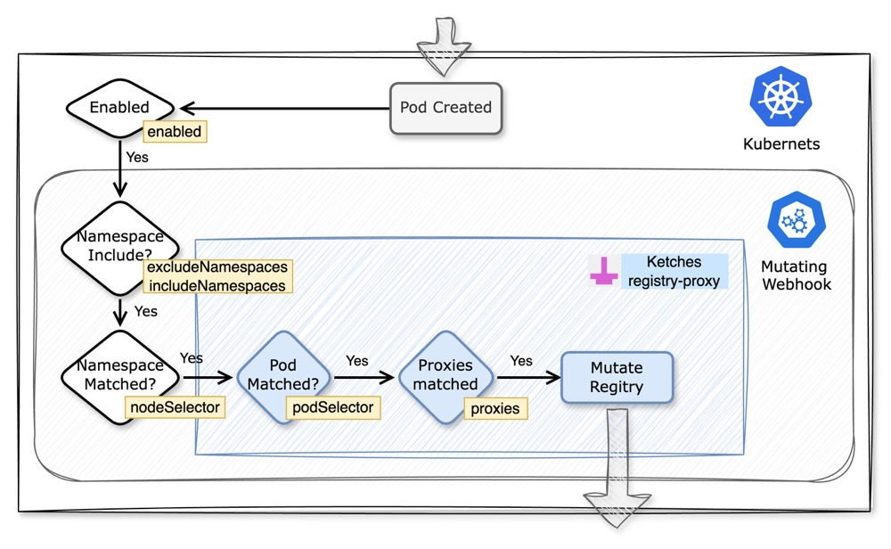

[](https://goreportcard.com/report/github.com/ketches/registry-proxy)
[](https://pkg.go.dev/github.com/ketches/registry-proxy)

# registry-proxy

在 Kubernetes 集群中部署 Registry Proxy，自动帮助您使用镜像代理服务拉取新创建的 Pod 中的外网容器镜像（仅限公有镜像）。

**适用场景：**

1. 无法拉取例如 K8s (`registry.k8s.io`) 、谷歌 (`gcr.io`) 等镜像；
2. 龟速拉取例如 GitHub(`ghcr.io`)、RedHat(`quay.io`) 等镜像；

**代理清单：**

默认镜像代理服务支持的外网镜像仓库：

- `docker.io`
- `registry.k8s.io`
- `quay.io`
- `ghcr.io`
- `gcr.io`
- `k8s.gcr.io`

## 快速安装

```bash
kubectl apply -f https://raw.githubusercontent.com/ketches/registry-proxy/master/deploy/manifests.yaml

# 使用 Ketches GitHub 代理
kubectl apply -f https://ghproxy.ketches.cn/https://raw.githubusercontent.com/ketches/registry-proxy/master/deploy/manifests.yaml
```

## 配置

`registry-proxy` 安装后自动创建 ConfigMap `registry-proxy-config`，ConfigMap 内容为默认配置，可以通过修改 ConfigMap 来修改默认配置。

### 默认配置

```yaml
apiVersion: v1
kind: ConfigMap
metadata:
  name: registry-proxy-config
  namespace: registry-proxy
data:
  config.yaml: |
    enabled: true
    proxies:
      docker.io: docker.linkos.org
      registry.k8s.io: k8s.linkos.org
      quay.io: quay.linkos.org
      ghcr.io: ghcr.linkos.org
      gcr.io: gcr.linkos.org
      k8s.gcr.io: k8s-gcr.linkos.org
    excludeNamespaces:
    - kube-system
    - kube-public
    - kube-node-lease
    - registry-proxy
    includeNamespaces:
    - "*"
    podSelector: {}
    namespaceSelector: {}
```

### 配置说明

**enabled：**

是否开启 registry-proxy 代理功能，boolean 类型，默认为 `true`, 可选值为 `true` 或 `false`；

**proxies：**

镜像代理地址，键为需要代理的镜像地址，值为代理地址，键值对形式，默认使用 [OpenLinkOS/registry-mirrors](https://github.com/OpenLinkOS/registry-mirrors) 镜像代理服务；

**excludeNamespaces：**

排除的命名空间，数组形式，默认排除 `kube-system`、`kube-public`、`kube-node-lease`、`registry-proxy` 命名空间下的 Pod 容器镜像代理；

**includeNamespaces：**

包含的命名空间，数组形式，默认 (`*`) 来包含被排除以外的所有命名空间下的 Pod 容器镜像代理；

**podSelector：**

Pod 选择器，键值对形式，默认为空，支持 Pod 选择器，例如：`app: nginx`；

**namespaceSelector：**

命名空间选择器，键值对形式，默认为空，支持命名空间选择器，例如：`owner: johndoe`；

## 实现原理

使用 Mutating Webhook 准入控制器实现。 当集群中 Pod 创建时，Mutating Webhook 的工作流程如下：

1. 当 Pod 创建时，Mutating Webhook 会拦截请求；
2. 通过 `enabled` 参数判断是否开启代理功能，如果开启，继续流程；
3. 通过 `excludeNamespaces` 和 `includeNamespaces` 参数判断 Pod 所在命名空间是否需要代理，如果是，继续流程；
4. 通过 `namespaceSelector` 参数命名空间标签，如果匹配，继续流程；
5. 通过 `podSelector` 参数匹配 Pod 标签，如果匹配，继续流程；
6. 通过 `proxies` 参数判断 Pod 中的容器镜像是否需要代理，如果是，继续流程；
7. 通过 `proxies` 参数替换容器镜像地址，完成代理，Mutating Webhook 响应请求，结束流程。



## 使用示例

使用 Docker 镜像 nginx 创建一个 Pod：

```bash
kubectl apply -f https://raw.githubusercontent.com/ketches/registry-proxy/master/examples/dockerhub-nginx.yaml

# 使用 Ketches GitHub 代理
kubectl apply -f https://ghproxy.ketches.cn/https://raw.githubusercontent.com/ketches/registry-proxy/master/examples/dockerhub-nginx.yaml
```

示例中的 Pod 镜像为 `nginx:latest`，经过 `registry-proxy` 自动代理后，容器镜像变为 `docker.linkos.org/library/nginx:latest`。

验证：

```bash
kubectl get pod dockerhub-nginx -o=jsonpath='{.spec.containers[*].image}'
```

## 卸载&清理

**卸载**：

```bash
kubectl delete -f https://raw.githubusercontent.com/ketches/registry-proxy/master/deploy/manifests.yaml

# 使用 Ketches GitHub 代理
kubectl delete -f https://ghproxy.ketches.cn/https://raw.githubusercontent.com/ketches/registry-proxy/master/deploy/manifests.yaml
```

**清理示例**：

```bash
kubectl delete -f https://raw.githubusercontent.com/ketches/registry-proxy/master/examples/dockerhub-nginx.yaml

# 使用 Ketches GitHub 代理
kubectl delete -f https://ghproxy.ketches.cn/https://raw.githubusercontent.com/ketches/registry-proxy/master/examples/dockerhub-nginx.yaml
```

## 代理参考

| 镜像地址 | 代理地址 |
| --- | --- |
| nginx:latest | docker.linkos.org/library/nginx:latest |
| ketches/registry-proxy:latest | docker.linkos.org/ketches/registry-proxy:latest |
| registry.k8s.io/pause:3.9 | k8s.linkos.org/pause:3.9 |
| registry.k8s.io/ingress-nginx/controller:v1.8.2 | k8s.linkos.org/ingress-nginx/controller:v1.8.2 |

## ✨ Stars

[](https://starchart.cc/ketches/registry-proxy)
